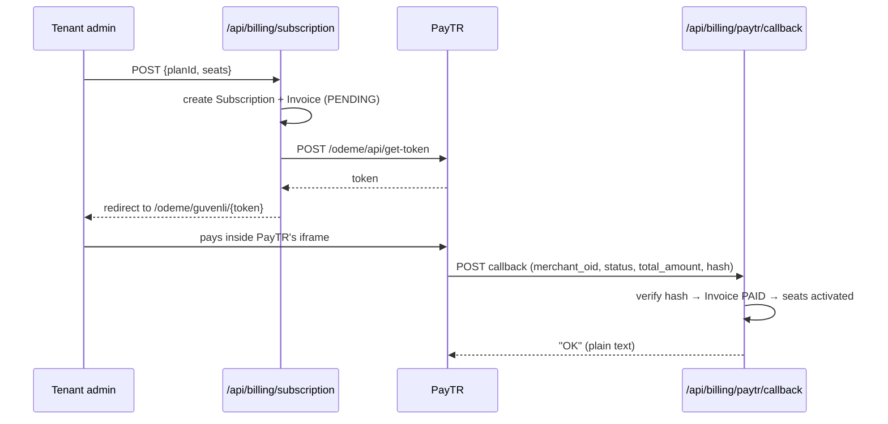
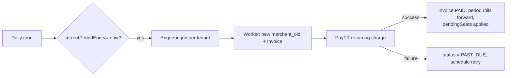
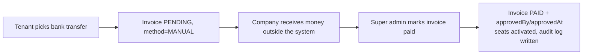

# Billing — PayTR seat-based subscriptions

Status: **Phases 1–8 complete.** Data model, PayTR provider, callback, billing
services, API routes, seat enforcement, renewal/dunning worker, the sandbox
guide (§9) and the go-live infrastructure (§10) are all implemented and tested.

Switching to a live merchant account is a manual procedure with its own
document: **`docs/paytr-golive-checklist.md`**.

One capability is **not** live: automatic card charging, which depends on two
answers from PayTR — see §7. Renewal works today by emailing an invoice and a
payment link.

---

## 1. How this differs from the original spec

The original prompt targeted a different project (`bizsim-backend`: Express,
`src/modules/<name>/{controller,service,repository,routes}`, SQS, ECS). This
repository is a **Next.js 16 App Router** app, so the module layout was adapted.
Everything else in the spec is preserved.

| Spec said | This repo does | Why |
| --- | --- | --- |
| `src/modules/billing/{controller,routes}.ts` | `src/app/api/billing/**/route.ts` | App Router owns HTTP routing |
| `service.ts` / `repository.ts` | `src/lib/billing/*-service.ts` | Matches existing `src/lib/<domain>/` convention |
| SQS + ECS worker | `src/lib/queue/` + `scripts/queue-worker.ts` | Existing queue infrastructure |
| `status` as Prisma `enum` | `String` + TS union in `src/lib/types.ts` | **The SQLite connector used in dev does not support Prisma enums** — the whole schema already uses `String` |
| `rawResponse Json` | `String` (JSON-encoded) | SQLite has no native `Json` type |
| New `WebhookEvent` table | Reuses the existing `webhook_events` table | It already enforces idempotency via `@@unique([provider, externalEventId])`; `merchant_oid` is stored as `externalEventId` |
| `SELECT ... FOR UPDATE` | Guarded by `isPostgresDatabase()` | Dev runs SQLite, which has no row-level locking — see §6 |

### Provider consolidation

The repo previously shipped three payment adapters (Stripe, Payriff, iyzico).
Per the decision on this project, **PayTR becomes the only provider** and the
other three are removed in Phase 2. The `PaymentProviderAdapter` interface in
`src/lib/payment/types.ts` is kept so another provider can be added later.

### Two ways to pay

1. **PayTR** — card payment, self-service, automatic monthly renewal.
2. **Manual / offline** ("əldən-ələ") — the tenant transfers money directly to
   the company. An `Invoice` is created with `method = MANUAL` and stays
   `PENDING` until a **super admin** confirms it. Confirmation records
   `approvedBy` + `approvedAt` and writes an audit entry.

---

## 2. Data model

All money is **integer kuruş** (1 TRY = 100 kuruş). Floating point is never used
for money. The legacy `payments` table keeps its `Float` columns as historical
data and receives no new writes.

| Table | Purpose |
| --- | --- |
| `plans` | Price template: `pricePerSeatMonthly`, `minSeats`, `trialDays` |
| `subscriptions` | One per tenant. Status, seat count, period window, dunning state. Carries `pricePerSeatMonthly` as the **per-tenant contract price**, snapshotted at signup |
| `payment_methods` | PayTR card vault handles (`utoken`, `ctoken`, `cardMask`, `cardBrand`) |
| `invoices` | One row per charge. `merchantOid` unique. `method` = `PAYTR` \| `MANUAL` |
| `payment_transactions` | One row per charge *attempt*, with raw provider response |
| `seat_change_logs` | Audit trail of every seat change |
| `webhook_events` | Existing table, reused for PayTR callback idempotency |

### Pricing is per tenant

Price is negotiated per company. `Plan` holds the default; the agreed price is
copied into `Subscription.pricePerSeatMonthly` at signup, so later plan edits
never silently re-price an existing customer.

### Subscription status

```
TRIALING ──► ACTIVE ──► PAST_DUE ──► EXPIRED   (read-only, data retained)
                │            │
                └────────────┴──► CANCELED
```

---

## 3. Flows

### 3.1 First payment

Card data never touches this system — the customer types it into PayTR's own
iframe. If the callback happens to carry a `utoken`, it is stored for future
automatic charges; nothing depends on it arriving (see §7).



### 3.2 Monthly renewal

A daily cron enqueues **one job per tenant** whose `currentPeriodEnd <= now()`,
so one failure cannot affect other tenants. Jobs run in the worker process
(`scripts/queue-worker.ts`), never in a request handler.



### 3.3 Dunning

Retries on **day 1, 3 and 5**, counted from the first failure — the clock is
never restarted by a later failure. Each attempt emails the tenant admin. This
codebase has no in-app notification module, so email is the only channel.

After **7 days** unpaid the subscription becomes `EXPIRED` and the tenant goes
**read-only — no data is deleted**. Paying at any point (card, bank transfer or
super-admin approval) returns it to `ACTIVE` and clears the dunning state.

A payment POST is never retried automatically in place; a genuine re-charge
goes through a fresh invoice, because PayTR order ids must never be reused.

### 3.4 Seat changes

| Direction | When it applies | Money |
| --- | --- | --- |
| **Increase** | Immediately | Prorated charge, taken **before** the seat count is written — both in one transaction. Payment fails ⇒ seats unchanged |
| **Decrease** | End of current period (`pendingSeats`) | No refund |

```
prorated = round(pricePerSeat × addedSeats × daysRemaining / daysInPeriod)
```

Rounding happens in exactly one place (`src/lib/billing/money.ts`) using
`Math.round`, on integer kuruş.

Guard rails: seats may never drop below `Plan.minSeats`, and
`activeUsers <= seats` is enforced by a seat-guard on user invite/activation,
which returns **402 `SEAT_LIMIT_EXCEEDED`**.

### 3.5 Manual / offline payment



---

## 4. Endpoints

| Method | Path | Permission |
| --- | --- | --- |
| GET | `/api/billing/plans` | `billing:read` |
| GET | `/api/billing/subscription` | `billing:read` |
| POST | `/api/billing/subscription` | `billing:write` |
| POST | `/api/billing/subscription/cancel` | `billing:write` |
| POST | `/api/billing/seats` | `billing:write` |
| GET | `/api/billing/seats/preview?seats=N` | `billing:read` |
| GET | `/api/billing/invoices` | `billing:read` |
| POST | `/api/billing/invoices/:id/approve` | `platform:admin`, SUPER_ADMIN only |
| POST | `/api/billing/paytr/callback` | **public** — no auth, no rate limit, hash-verified |

Not built yet: `GET /api/billing/invoices/:id` (PDF) and the
`/api/billing/payment-methods` endpoints, both of which depend on the card
storage question in §7.

### Enforcement

`src/lib/billing/seat-guard.ts` exposes `assertCanAddUsers()`, wired into the
student-join flow (`/api/join/[token]`) inside its transaction so the check and
the seat increment stay atomic. It raises:

| Condition | Status | `code` |
| --- | --- | --- |
| No free seats | 402 | `SEAT_LIMIT_EXCEEDED` |
| Subscription lapsed | 402 | `SUBSCRIPTION_EXPIRED` |

Tenants with no subscription pass both checks, so organisations that predate
billing are not locked out.

`apiErrorResponse` now honours any error carrying a numeric `statusCode` (and
optional `code`). Before this, domain errors — including the pre-existing ones
in `src/lib/seats/errors.ts` — all surfaced as 500.

---

## 5. Security

- `PAYTR_MERCHANT_ID` / `PAYTR_MERCHANT_KEY` / `PAYTR_MERCHANT_SALT` are secrets.
  Never committed, never logged, never sent to Sentry (`beforeSend` scrubbing).
  `.env.example` lists key **names only**.
- Card PAN, CVV and expiry never enter this system. Only `utoken`, `ctoken`,
  `cardMask`, `cardBrand` are stored.
- The callback endpoint performs **no database write** before the hash check
  passes. Invalid hash ⇒ `400` + log.
- A successful callback must return the literal string `OK` (plain text, not
  JSON) or PayTR will keep retrying.
- Callbacks are idempotent: a duplicate `merchant_oid` is a no-op that still
  returns `OK`.
- Every payment and seat change is written to the `audit` module.
- Provider calls use a 10s timeout. **Read** operations may be retried;
  **payment POSTs are never auto-retried** (double-charge risk) — retry only at
  the job level with a fresh `merchant_oid`.

---

## 6. Local dev caveat: SQLite vs Postgres

Production is Postgres; local dev is SQLite. Postgres-only SQL must be guarded:

```ts
import { isPostgresDatabase } from "@/lib/db/tenant-context";
```

`SELECT ... FOR UPDATE` (used to serialise seat changes against renewal) works
only on Postgres. On SQLite the surrounding transaction already serialises
writes, so a plain read is used instead. This mirrors the existing pattern in
`seat-service.ts` and `registration-service.ts`.

---

## 7. PayTR facts, as documented

Every formula below was read from the official docs at `dev.paytr.com` — none
was written from memory. All are HMAC-SHA256 with `merchant_key`, base64-encoded,
and all are covered by unit tests in
`src/lib/payment/__tests__/paytr-hash.test.ts`.

| Operation | Endpoint | Hash string |
| --- | --- | --- |
| iFrame token | `/odeme/api/get-token` | `merchant_id + user_ip + merchant_oid + email + payment_amount + user_basket + no_installment + max_installment + currency + test_mode + merchant_salt` |
| Callback verify | (our URL) | `merchant_oid + merchant_salt + status + total_amount` |
| Saved-card list | `/odeme/capi/list` | `utoken + merchant_salt` |
| Card delete | `/odeme/capi/delete` | `ctoken + utoken + merchant_salt` |
| Recurring charge | `/odeme` | `merchant_id + user_ip + merchant_oid + email + payment_amount + payment_type + installment_count + currency + test_mode + non_3d + merchant_salt` |

Note the callback puts the salt **in the middle**, and card-delete puts
**ctoken before utoken**. Both are easy to get backwards.

Other confirmed details:

- `payment_amount` is an integer in kuruş (₺10 → `1000`).
- The callback's `total_amount` is likewise ×100.
- Recurring responses use `status`: `success` | `failed` | `wait_callback`.
- `merchant_oid`: alphanumeric, ≤64 chars, never reused. Ours is
  `BIZ{tenantId}{timestamp}{random}`.

### Open question: card storage

The original plan assumed the iFrame API accepts `store_card=1`. **The iFrame
step-1 documentation does not list `store_card` or `utoken`** — card storage is
documented only under the *Direkt* Kart Saklama API, whose request carries
`card_number`, `cvv` and `expiry_*` directly.

That path is deliberately **not implemented**: raw card data must never enter
this system. Consequences:

- The one-off iFrame payment flow works today and is fully implemented.
- **Automatic** monthly charging needs a stored card, so it is blocked until
  PayTR confirms either (a) that the iFrame flow can vault a card and return a
  `utoken` on the notification, or (b) that we should use a hosted alternative.
- Non3D permission is separately required for recurring charges. Until both are
  confirmed, `PAYTR_NON3D_ENABLED` stays `0` and renewal falls back to sending
  the tenant a payment link each period (or the manual/offline flow).

The client code for the saved-card endpoints (`listStoredCards`,
`deleteStoredCard`, `chargeStoredCard`) is written and tested, so enabling the
automatic path is a configuration change plus wiring, not a rewrite.

---

## 8. Phase plan

| Phase | Scope | Status |
| --- | --- | --- |
| 1 | Prisma models + migration + this document | ✅ done |
| 2 | PayTR client, hash, types, config + unit tests; Stripe/Payriff/iyzico removed | ✅ done |
| 5 | Callback endpoint + idempotency (brought forward — it pairs with the provider) | ✅ done |
| 3 | Billing services (subscription, seats, proration) + tests | ✅ done |
| 4 | Routes, validators, seat-guard | ✅ done |
| 6 | Queue + worker (renewal, dunning) + email | ✅ done |
| 7 | Sandbox walkthrough (test cards, `test_mode`, tunnelling callbacks) | ✅ done — see §9 |

### What Phase 2 delivered

| File | Purpose |
| --- | --- |
| `src/lib/billing/money.ts` | Integer-kuruş arithmetic, single rounding rule, proration |
| `src/lib/payment/paytr/paytr.hash.ts` | Pure token/hash functions, constant-time callback verify |
| `src/lib/payment/paytr/paytr.client.ts` | HTTP calls, 10s timeout, retries on reads only |
| `src/lib/payment/paytr/paytr.config.ts` | Credential loading; never logged |
| `src/lib/payment/paytr/paytr.types.ts` | Wire types mirroring PayTR field names |
| `src/lib/payment/paytr-provider.ts` | `PaymentProviderAdapter` implementation |
| `src/app/api/billing/paytr/callback/route.ts` | Public, hash-verified notification endpoint |
| `src/lib/monitoring/scrub-secrets.ts` | Sentry `beforeSend` redaction |

### What Phase 3 delivered

| File | Purpose |
| --- | --- |
| `src/lib/billing/period.ts` | Month arithmetic; clamps 31 Jan → 28 Feb so periods never drift |
| `src/lib/billing/subscription-service.ts` | Create/cancel, write-access rule, row lock |
| `src/lib/billing/seat-change-service.ts` | Preview, increase (billed first), decrease (deferred), rollover |
| `src/lib/billing/invoice-service.ts` | Invoice lifecycle, seat application, manual approval |
| `src/lib/billing/errors.ts` | Typed errors carrying HTTP status codes |

Two decisions were taken by default, and are easy to change:

- **`EXPIRED` means read-only**, not locked out: the tenant keeps its data and
  can still sign in and read. `tenantHasWriteAccess()` is the single place that
  decides this, and a tenant with *no* subscription stays writable so existing
  organisations are not locked out by billing's arrival.
- **Trials are off** (`trialDays = 0`). The column and the `TRIALING` status
  both work; setting a non-zero `trialDays` on a plan enables it.

### What Phase 4 delivered

| File | Purpose |
| --- | --- |
| `src/lib/billing/validators.ts` | Zod schemas; money is never accepted from the client |
| `src/lib/billing/seat-guard.ts` | 402 enforcement for seats and lapsed subscriptions |
| `src/lib/billing/checkout-service.ts` | Turns an invoice into a PayTR payment page |
| `src/lib/billing/callback-service.ts` | Applies a verified callback to an invoice, idempotently |
| `src/app/api/billing/**` | The routes in §4 |

Amounts are always computed server-side from the subscription's contract price,
so a tampered request cannot change what is charged — the client only ever
sends a seat count.

Behaviour worth knowing:

- A decrease is **clamped at rollover** to the number of seats actually
  occupied — if users joined after the downgrade was scheduled, they are never
  stranded.
- Seat counts are mirrored to `Tenant.seatLimit`, which is what registration
  and the rest of the app already enforce against.

### What Phase 6 delivered

| File | Purpose |
| --- | --- |
| `src/lib/billing/renewal-service.ts` | Finds due subscriptions, renews one tenant |
| `src/lib/billing/dunning-service.ts` | Retry schedule, expiry, recovery |
| `src/lib/billing/recurring-service.ts` | Charges a vaulted card when that is possible |
| `scripts/billing-cron.ts` | Daily sweep — enqueues only, does no billing itself |
| `src/lib/queue/handlers.ts` | `SUBSCRIPTION_RENEWAL` / `SUBSCRIPTION_DUNNING` handlers |

Renewal works **today, without stored cards**. When no card is on file (the
current situation) the tenant is emailed an invoice and a payment link. If card
vaulting and Non3D are later confirmed, setting `PAYTR_NON3D_ENABLED=1` turns
the same flow into an automatic charge — no code change.

Order inside a renewal matters: a scheduled seat decrease is applied *before*
the new period is priced, so the tenant is billed for the seats they asked for.

Failure to build a payment link never aborts a renewal — the invoice still
exists and is payable from the billing screen.

There is no in-app notification module in this codebase, so dunning notifies by
email only.

---

## 9. Sandbox testing walkthrough

### 9.1 Credentials

Put the sandbox values from the PayTR merchant panel in `.env` (gitignored):

```
PAYTR_MERCHANT_ID="..."
PAYTR_MERCHANT_KEY="..."
PAYTR_MERCHANT_SALT="..."
PAYTR_TEST_MODE="1"
PAYTR_NON3D_ENABLED="0"
```

`PAYTR_TEST_MODE=1` marks every request as a test transaction, so no money
moves. Until real credentials are in place, PayTR answers token requests with
*"Gecersiz istek veya magaza aktif degil"* — that is the expected response to
placeholder values, not a bug in this code.

### 9.2 Test cards

From the PayTR docs (`/direkt-api/test-kart-bilgileri`). Expiry `12/30`,
CVV `000`, cardholder name anything (e.g. `PAYTR TEST`):

| Card number |
| --- |
| 4355 0843 5508 4358 |
| 5406 6754 0667 5403 |
| 9792 0303 9444 0796 |

The documentation does not say which card simulates a decline, and these are
listed for the Direct API. Ask PayTR support for the iFrame decline scenario
rather than guessing.

### 9.3 Receiving callbacks on a local machine

PayTR posts the notification server-to-server, so `localhost` is unreachable
from their side. Expose the dev server through a tunnel and register that URL
as the notification URL in the merchant panel:

```bash
npx localtunnel --port 3000
```

Then set the notification URL to `https://<your-tunnel>/api/billing/paytr/callback`.

Any HTTPS tunnel works (`cloudflared tunnel --url http://localhost:3000`,
`ngrok http 3000`). The callback endpoint is intentionally outside auth and
rate limiting, so nothing else needs changing.

### 9.4 Verifying the callback without PayTR

The hash is the only thing that authenticates a callback, so it can be
reproduced locally. Forged hashes must be rejected:

```bash
curl -i -X POST http://localhost:3000/api/billing/paytr/callback \
  -H "Content-Type: application/x-www-form-urlencoded" \
  -d "merchant_oid=BIZtest123&status=success&total_amount=250000&hash=forged"
```

Expect `400 Invalid hash`. A correctly signed callback for a real invoice
returns `200 OK` (the literal body PayTR requires) and marks the invoice paid.
Sending it twice must still return `OK` and must not grant seats twice.

### 9.5 Exercising renewal and dunning

Renewal triggers on `currentPeriodEnd <= now`, so back-date a subscription
rather than waiting a month:

```bash
npx tsx -e "import('dotenv/config');const{PrismaClient}=require('@prisma/client');const p=new PrismaClient();p.subscription.updateMany({data:{currentPeriodEnd:new Date(Date.now()-86400000)}}).then(r=>console.log(r)).finally(()=>p.\$disconnect())"
```

Then run the sweep and the worker:

```bash
npm run billing:cron
```

```bash
npm run worker:once
```

The sweep only enqueues; the worker does the billing. In development, emails
are written to `uploads/dev-emails/` as HTML instead of being sent — open them
in a browser to check the copy.

### 9.6 What to confirm with PayTR before going live

1. Can the **iFrame** flow vault a card and return a `utoken` on the
   notification? (The iFrame docs do not list `store_card`.) Without this,
   automatic renewal is not possible and the emailed-link flow stands.
2. Is **Non3D** enabled on the merchant account? Recurring charges require it.
3. Which test card simulates a **decline**, so the dunning path can be
   exercised end to end.

Until 1 and 2 are answered, leave `PAYTR_NON3D_ENABLED=0`.

---

## 10. Going live

Everything in §§1–9 was written against the sandbox. This section covers what
had to exist before a live merchant key could be used safely. The manual
procedure itself — what to request from the account holder, what to configure
in the PayTR panel, what to verify with a real card — is in
`docs/paytr-golive-checklist.md`.

### 10.1 Sandbox and live credentials are separate variables

`PAYTR_MODE` (`sandbox` | `live`) selects which credential set is read:

| Mode | Reads | `test_mode` sent to PayTR |
| --- | --- | --- |
| `sandbox` (default) | `PAYTR_SANDBOX_*`, falling back to the pre-split `PAYTR_MERCHANT_*` | always `1` |
| `live` | `PAYTR_LIVE_*` **only** | `0`, or `1` for the rehearsal |

Two decisions are worth stating:

- **An unset mode means sandbox.** A forgotten variable should cost a failed
  test payment, never a real charge.
- **The pre-split `PAYTR_MERCHANT_*` names are ignored in live mode.** Nothing
  about that name says whether it holds a sandbox or a production key, and
  guessing is exactly how test keys reach production. Sandbox still accepts
  them so existing local setups keep working.

`test_mode` is derived from the mode rather than set by hand, so the two cannot
disagree. The one surviving override — `PAYTR_TEST_MODE=1` while live — is the
go-live rehearsal: real credentials, real notification URL, no money moved. It
warns on every boot.

### 10.2 Fail fast at startup

`src/lib/env-check.ts` refuses to boot in production when `PAYTR_MODE=live` and
any of `PAYTR_LIVE_MERCHANT_ID/KEY/SALT` is missing, or when
`NEXT_PUBLIC_APP_URL` is not https (PayTR posts the notification to it). It
warns — rather than failing — when production is still pointed at the sandbox,
when live credentials are running in rehearsal mode, and when the ignored
pre-split variables are set.

A container that will not start is the intended outcome. A container that
starts and fails at checkout is worse: it passes its health check, takes
traffic, and produces a generic 503 that names no variable.

### 10.3 The callback reads the raw body

`readPaytrCallback` reads the notification with `request.text()` and parses the
string, rather than calling `request.formData()`. A body can only be read once,
and two things need the bytes as they arrived: the signature is computed over
the values PayTR sent, and a callback that fails to verify has to be stored
verbatim or there is nothing to take to PayTR support.

A correctly signed callback whose `merchant_oid` is not alphanumeric is also
refused — PayTR only ever issues alphanumeric order ids, so that shape never
reaches a database query.

### 10.4 Idempotency is a claim, not a check

The previous implementation read `webhook_events` and processed the
notification if no `PROCESSED` row was found. Two concurrent deliveries of the
same order — which PayTR does produce, because it retries until answered — both
pass that check and both grant seats.

`claimCallback` inserts into `webhook_events` instead and lets the unique index
on `(provider, external_event_id)` decide the winner. The loser is told the
work is in flight and answers `409`, so PayTR redelivers rather than dropping
the notification. A claim left behind by a process that died is retaken after
five minutes, and a claim is released explicitly when the order matches no
invoice, so the redelivery that arrives once the invoice exists is not turned
away.

### 10.5 `paytr_webhook_events`

`webhook_events` holds one row per order, because that is what makes the
callback idempotent. It therefore cannot answer the questions a disputed
payment actually raises: how many times did PayTR call, did an earlier delivery
carry a different status, was a call rejected for a bad hash and never seen
again.

`paytr_webhook_events` is the other half — **one row per HTTP request**,
duplicates and rejections included, written before the payload is acted on and
completed afterwards, so a crash mid-processing still leaves evidence. Failing
to write it never fails a payment.

| Column | Note |
| --- | --- |
| `hash_valid` | Whether the signature verified. The hash itself is never stored. |
| `mode` | `sandbox` \| `live` — which credential set was in use. |
| `outcome` | `RECEIVED` → `PROCESSED` \| `DUPLICATE` \| `REJECTED` \| `UNMATCHED` \| `IN_FLIGHT` \| `ERROR` |
| `remote_ip` | Recorded, never enforced on — see the checklist §3. |
| `raw_payload` | Masked, see §10.6. |

### 10.6 Masking

`src/lib/payment/paytr/paytr-log.ts` is the single place that decides what a log
line or a stored payload may contain. Redacted everywhere: merchant key, salt
and id, `paytr_token`, the callback `hash`, and any card field. Card handles
(`utoken`, `ctoken`) are reduced to a stable non-reversible fingerprint, which
is enough to tell whether two failed renewals concern the same card without
carrying something that can charge it.

The callback `hash` is masked even though it is a signature rather than a key:
it is valid signing material for its own notification, so a stored copy is
replayable. What is worth knowing — whether it verified — is the `hash_valid`
boolean instead.

The redaction is a denylist rather than an allowlist on purpose. The point of
keeping the raw callback is to debug fields we did not anticipate; an allowlist
would drop exactly those.

### 10.7 Structured logs

One JSON object per line, tagged `"component":"paytr"`, covering the payment
lifecycle: `checkout.token_requested` / `_issued` / `_failed`,
`callback.received` / `_rejected` / `_duplicate` / `_processed` / `_failed` /
`_unmatched`, and `recurring.charge_started` / `_succeeded` / `_declined` /
`_failed` / `skipped`. Every line carries the mode, and every field passes
through the masking above before it is written.

### 10.8 `npm run paytr:smoke`

`scripts/paytr-smoke-test.ts` exercises the whole path against the sandbox:
token request → signed callback → invoice paid → seats granted → replayed
callback grants nothing more → forged hash rejected → every delivery logged
with no hash stored.

It refuses to run while `PAYTR_MODE=live`, with no flag to override that, and
it creates and removes its own tenant, plan, subscription and invoice rather
than touching existing rows. The callback steps POST to the running
application, not to the service directly, so the route, the hash check and the
raw-body handling are all part of what is tested.
